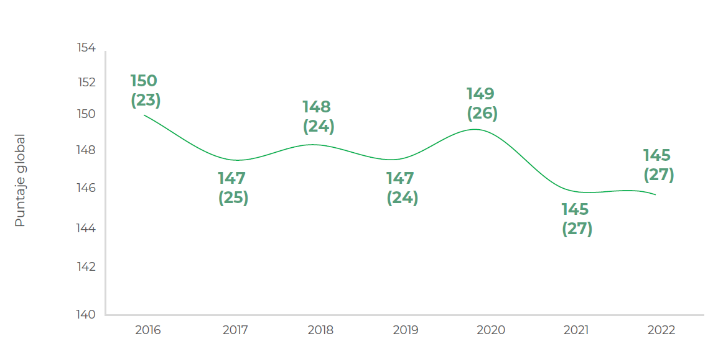

# Contextualización del Problema

## ¿Cómo identificar de manera oportuna y precisa aquellos estudiantes que obtendrán un rendimiento inferior en la Prueba SABER PRO?

Las pruebas SABER PRO representan una herramienta fundamental de evaluación estandarizada en Colombia, destinada a medir tanto las competencias genéricas como específicas de los estudiantes universitarios. Los resultados de estas pruebas no solo son cruciales para los estudiantes, ya que reflejan su preparación académica y profesional, sino también para las instituciones de educación superior. Estos resultados proporcionan una evaluación integral de la calidad de la formación impartida, identificando tanto áreas de excelencia como aspectos que requieren mejora {cite}`icfes2023`.

*Promedio del puntaje global según sede de las IES en el examen Saber Pro 2023.*

A pesar de su importancia, en el Informe de Nacional de Resultados del ICFES {cite}`icfes2023`, un número significativo de estudiantes que no logran alcanzar los resultados esperados en las pruebas SABER PRO. Esta situación no solo repercute en el desarrollo académico y profesional de los individuos, sino también en el prestigio y posicionamiento de las universidades en los rankings nacionales.

*Promedio del puntaje global y desviación estándar en Saber Pro (2016-2022)*

Diversos autores han intentado identificar las variables que pueden influir negativamente en el rendimiento de los estudiantes en estas pruebas. Entre estas, se encuentran las dificultades académicas, los factores socioeconómicos,{cite}`narvaez2023`, la desmotivación o falta de interés, los problemas de salud física o mental, los problemas personales o familiares, {cite}`demarchi2023` así como la falta de familiaridad con el formato de la prueba. Aunque algunas de estas variables pueden resultar difíciles de abordar, es crucial tenerlas en cuenta al diseñar estrategias de intervención para mejorar el desempeño estudiantil.

Además, es fundamental reconocer que la diversidad de factores que influyen en el rendimiento estudiantil exige un enfoque integral y multidisciplinario para su abordaje {cite}`avelino2019`. De esta manera, se pueden implementar acciones efectivas que promuevan un ambiente educativo propicio para el desarrollo integral de los estudiantes y el cumplimiento de sus metas académicas y profesionales.

En este contexto, surge una necesidad imperativa de identificar de manera oportuna a aquellos estudiantes que potencialmente obtendrán un puntaje bajo en la prueba SABER PRO. La anticipación de estas dificultades es crucial para implementar intervenciones tempranas y efectivas que puedan mejorar el desempeño académico y maximizar el éxito estudiantil. Sin embargo, la falta de una metodología efectiva y temprana para realizar esta identificación constituye un desafío significativo para las instituciones educativas.

Es evidente la urgencia de desarrollar e implementar estrategias y herramientas que permitan detectar y apoyar a los estudiantes en riesgo de manera proactiva. Una metodología efectiva de identificación temprana no solo contribuirá a mejorar el rendimiento estudiantil, sino que también fortalecerá la calidad educativa y el posicionamiento de las instituciones en el panorama nacional e internacional. En este sentido, se requiere un enfoque innovador que integre técnicas avanzadas de analítica de datos y aprendizaje automático para identificar patrones y tendencias que indiquen el riesgo de bajo rendimiento en las pruebas SABER PRO. Esta aproximación permitirá a las instituciones educativas ofrecer un apoyo personalizado y dirigido a aquellos estudiantes que lo necesiten, promoviendo así su desarrollo académico y profesional de manera integral.
